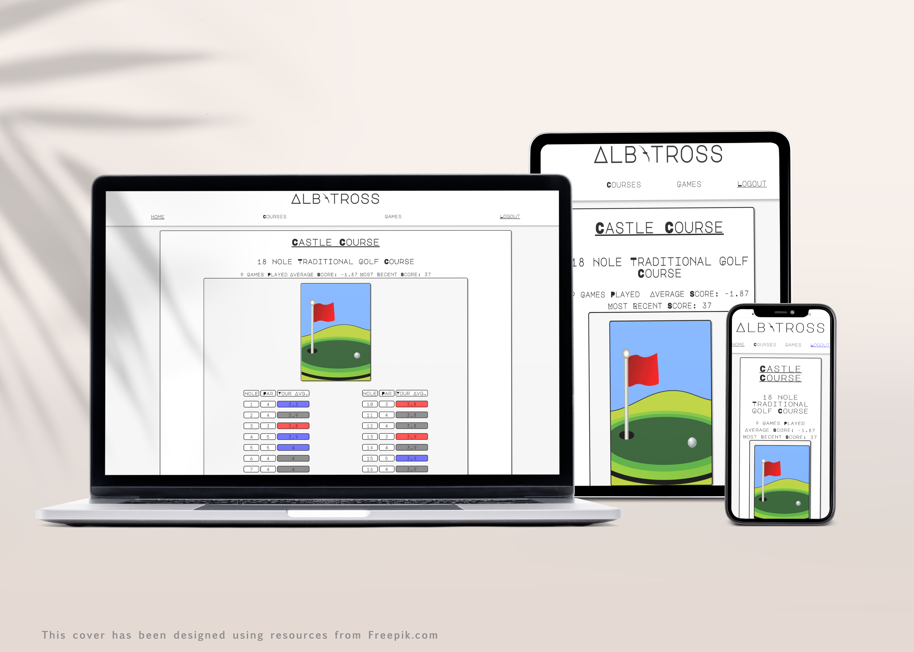

## Albatross - Personal Golf Tracker
#### https://albatross4golf.herokuapp.com/

Created By C. Marshall Moriarty

### Description
Albatross is a web application that allows users to create a personal library of their favor Traditional, Putt Putt, or Disc Golf Courses. Users may log games played on courses in their library to track their progress (or lack thereof) over time. Albatross is optimized for moble devices and designed to be easy to use while on the course.

Why Albatross? Albatross referes to the the instance in golf where a player completes a hole three strokes under par; a rare and remarkable achievement.

### Screenshots

### Technologies
- JavaScript
- Express.JS
- HTML
- CSS
- EJS
- MongoDB
- Auth0
- Course API

### Getting Started
Visit: https://albatross4golf.herokuapp.com/

To use all of the features of Albatross all that is needed is a login. The site uses Auth0 user authentication and authorization and you can create an account using a valid e-mail or using an existing Gmail.

Courses: Under the Course menu, users can view all courses, just public, or just personal courses. They may create a new personal course and begin a game while viewing any course in their library.

Games: Under the Games menu, users can view all, completed or unfinished game or begin a new game. When a game is marked as completed, the game is no longer available for editing and stats recorded into the usere's personal course library.

### API
Albatross offers an API for getting information on public courses in JSON format.

Use, simply make a get request to https://albatross4golf.herokuapp.com/api to retrieve all public courses.

The following filters can be added as queries in the URL:
- type (Putt_Putt, Traditional_Golf, Disc_Golf)
    - Example: https://albatross4golf.herokuapp.com/api?type=Putt_Putt
- title (separate words with underscores)
    - Example: https://albatross4golf.herokuapp.com/api?title=castle_course
- holes
    - Example: https://albatross4golf.herokuapp.com/api?holes=18
- totalPar
    - Example: https://albatross4golf.herokuapp.com/api?totalPar=53

### Next Steps
- Allow users to copy a public course into their personal library.
- UI Updates: link games to their courses.
- On Game Edit allow game complete only if all holes have values.
- Game scorecards that allow for tracking more than one players in a single game.
- Enhanced filtering of games and courses by date, name & type.